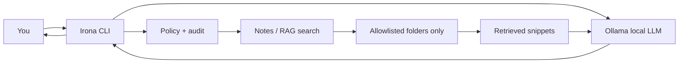

# Irona

> *Named after Irona — the robot housekeeper from Richie Rich who could do whatever was asked. This is the same idea, just permissioned and auditable: ask it anything, but it only acts within boundaries you set.*

**Irona** is a **permissioned, auditable RAG agent** for macOS: local inference (Ollama), measured retrieval over allowlisted files, and an explicit policy layer. It is a learning lab for LLMs, RAG, and edge ML infrastructure—not a cloud chatbot clone.

> **Thesis:** Most local-RAG tutorials stop at "it answers." Irona measures **whether the right file is retrieved**, logs **what tools ran**, and documents **what breaks on 16GB RAM** with pre-trained models. See [docs/THE_LOCAL_GAP.md](docs/THE_LOCAL_GAP.md).


<p align="center">
  <code>start irona</code>
</p>

---

## Why Irona?

| | Irona | Cloud assistants (ChatGPT, Claude, Gemini) |
|--|---------|---------------------------------------------|
| **Where data goes** | Stays local (Ollama + your disk) | Vendor cloud |
| **Who controls access** | You (allowlisted paths, approvals) | Vendor product policy |
| **Offline** | Yes, after models are downloaded | Limited |
| **Cost** | Free inference after setup | Subscriptions / API |
| **Raw IQ** | Smaller local model (~7B) | Frontier models |

Irona is for people who want **control and privacy** first, and are fine trading some answer quality for that.

---

## Why build this when ChatGPT, Claude, and Gemini already exist?

Frontier cloud assistants are excellent at general reasoning, writing, and coding. This project is **not** trying to beat them on a leaderboard. It exists because they solve a **different problem** than the one I cared about.

**1. Learning how assistants actually work**  
Using ChatGPT is like driving a car. Building Irona is like opening the hood: local inference (Ollama), retrieval, tool permissions, audit logs, and config-driven boundaries. That exposure is the main goal—not shipping a commercial competitor.

**2. Privacy for real personal data**  
Course folders, transcripts, work notes, and drafts are sensitive. With Irona, prompts and retrieved file text stay on **my Mac** by default. Cloud tools can be careful with policy, but I cannot **see or change** their enforcement code. Here I can.

**3. Permissions I can enforce in code**  
I wanted rules that are explicit and boring: only certain folders, approval before search, an audit trail, no silent web or calendar access. Irona's policy layer is small on purpose—it is the product.

**4. A buddy I own and can share safely**  
Colleagues can clone the repo, run their own Ollama model, and use **their** allowlisted paths. No shared cloud account, no commingled data.

**5. Honest tradeoff**  
Irona uses a ~7B local model, so it will not match Claude or GPT-4 on hard tasks. That is acceptable: the value is **control, citations from local files, and learning**—not replacing every cloud agent.

**When I still use cloud AI:** open-ended research, heavy coding reviews, or tasks where maximum model quality matters. Irona and cloud tools can coexist.

---

## Features (v0.4)

- **Local chat** via [Ollama](https://ollama.com) (default: Qwen 2.5 7B)
- **Allowlisted file search** - `.md`, `.txt`, `.pdf`, `.docx`, and more
- **Semantic search** - `irona index` builds an embedding index for better "meaning" matches
- **Retrieval evaluation** - `irona eval` compares keyword vs semantic vs hybrid ([EVAL.md](EVAL.md))
- **Generation evaluation** - `irona eval --generation` scores LLM answers + citations
- **WhatsApp draft** - `irona whatsapp PHONE "msg"` opens pre-filled chat; **you tap Send** ([docs/WHATSAPP.md](docs/WHATSAPP.md))
- **Voice** - `/listen` + optional `/voice on` (off by default; Whisper + macOS `say`)
- **Source citations** - answers can include `Sources:` with file paths
- **Interactive session** - `irona start`, with `/help`, `/strict`, `/approve`, `web` / `/web`
- **Security by default** - tools denied unless configured; optional approval before reading notes
- **Audit log** - `~/.irona/audit.log`

**Docs:** [Architecture](docs/ARCHITECTURE.md) · [The local gap](docs/THE_LOCAL_GAP.md) · [Trust model](docs/TRUST.md) · [Evaluation](EVAL.md)

**Optional (enable in config):** calendar, web, WhatsApp draft, voice. See [docs/FEATURES.md](docs/FEATURES.md). **Deferred:** menu-bar app, auto-send messaging.

### Evaluation snapshot (public demo)

Reproducible on clone with `irona eval --demo` (uses `eval/fixtures/corpus/` only):

| Mode | Recall@1 | Recall@5 | MRR |
|------|----------|----------|-----|
| keyword | 86% | 86% | 0.857 |
| semantic | 43% | 57% | 0.500 |
| hybrid | 43% | 57% | 0.500 |

For **your** documents: `./scripts/init-user.sh`, edit `user/questions.jsonl`, set `allowed_paths` in `config.yaml`, run `irona index` then `irona eval`. Results go to `eval/results/latest.md` (gitignored).

**Tip:** Use one project folder in `allowed_paths`, not your entire home or tree.

---

## Requirements

- **macOS** (Apple Silicon recommended, e.g. M-series Mac)
- **Python 3.11+**
- **Ollama** installed and running
- **~10–30 GB** free disk (LLM + optional index + embeddings)
- **16 GB RAM** recommended for comfortable 7B model use

---

## Quick start

### 1. Install Ollama and pull a model

Download from [ollama.com](https://ollama.com/download), then:

```bash
ollama pull qwen2.5:7b-instruct
```

### 2. Install Irona

```bash
git clone <your-repo-url> irona
cd irona
chmod +x install.sh
./install.sh
```

Or manually:

```bash
python3 -m venv .venv
source .venv/bin/activate
pip install -e .
cp config.example.yaml config.yaml
./scripts/init-user.sh
```

Edit `config.yaml` and set **your** allowed folder(s):

```yaml
allowed_paths:
  - "/path/to/your/folder"
```

### 3. Build the semantic index (recommended)

```bash
source .venv/bin/activate
irona index
```

### 4. Start chatting

```bash
start irona
```

On first use you may be asked to approve note access (`/approve` or answer `y` when prompted).

---

## Commands

| Command | Description |
|---------|-------------|
| `start irona` | Main entry - interactive chat |
| `irona start` | Same as above |
| `irona version` | Show version |
| `irona doctor` | Health check (Ollama, config, index, deps) |
| `irona config` | Show loaded configuration |
| `irona index` | Build/update semantic search index |
| `irona ask "..."` | One-shot question with file retrieval |
| `irona search "..."` | Search allowlisted paths only |
| `irona chat "..."` | Plain chat (no file retrieval) |
| `irona calendar` | Read macOS Calendar (opt-in) |
| `irona web "..."` | Web search (opt-in, needs network) |

---

## Interactive commands

Inside `start irona`:

| Command | Effect |
|---------|--------|
| `/help` | Show commands |
| `/bye` or `/exit` | Quit |
| `/notes on` / `/notes off` | Toggle file retrieval |
| `/strict on` / `/strict off` | Require local sources before answering |
| `/approve` | Approve note search for this session |
| `/approve all` | Approve files, calendar, and web for session |
| `/approve calendar.read` | Approve one tool by name |
| `/index` | Rebuild semantic index |
| `/config` | Show config |
| `/doctor` | Run health checks |
| `/calendar` | Read macOS Calendar (opt-in) |
| `/web QUERY` | Web search (opt-in) |

---

## Optional tools (calendar & web)

Off by default. Enable in `config.yaml`:

```yaml
enabled_tools:
  - calendar.read
  - web.search
```

- **calendar.read** - Apple Calendar on macOS (read-only). Grant Calendars access to Terminal/Cursor when prompted.
- **web.search** - DuckDuckGo over the network. Results are untrusted external content.

In `start irona` and `irona ask`, Irona auto-pulls calendar or web context when your question looks relevant (still permission-gated).

---

## Configuration

Irona loads config from (first match wins):

1. `~/.irona/config.yaml` - **recommended** for personal machines  
2. `./config.yaml` - project-local fallback  

Copy from `config.example.yaml`. **Do not commit** your real `config.yaml` (it may contain personal paths).

Key options:

| Key | Purpose |
|-----|---------|
| `allowed_paths` | Folders Irona may read (required for search) |
| `model_name` | Ollama model id |
| `require_tool_approval` | Prompt before searching notes |
| `use_embeddings` | Use semantic index when present |
| `voice_enabled` | Off by default; optional voice stack |

---

## How it works (high level)



The LLM never opens files directly. Your code searches allowlisted paths, passes text as context, and the model answers from that context.

---

## Security

- **Deny by default** for tools (calendar, web, etc. are stubs unless enabled).
- **Allowlist only** - no whole-disk search.
- **Audit trail** - `~/.irona/audit.log`.
- **No telemetry** built in.

Details: [SECURITY.md](SECURITY.md).

---

## Project layout

```text
irona/
├── README.md
├── config.example.yaml      # template (copy → config.yaml, gitignored)
├── scripts/init-user.sh     # creates user/ + config.yaml
├── user/                    # personal workspace (see user/README.md)
│   ├── corpus/              # optional local docs (gitignored contents)
│   └── questions.jsonl      # your eval gold set (gitignored)
├── eval/
│   ├── fixtures/corpus/     # public demo docs only
│   ├── questions.template.jsonl
│   └── results/             # gitignored output
├── docs/
└── src/
    ├── cli.py
    ├── chat.py
    ├── retrieval.py      # keyword / semantic / hybrid
    ├── rag.py
    ├── notes.py
    ├── policy.py
    └── tools.py
```

---

## Sharing with others

See **[SHARE.md](SHARE.md)** for a colleague setup guide.

Short version:

1. Clone the repo (no `config.yaml` in git).  
2. Run `./install.sh`.  
3. Edit `allowed_paths` in `config.yaml`.  
4. `ollama pull qwen2.5:7b-instruct` → `irona index` → `irona start`.  

Each person keeps their data on their own Mac.

---

## Before you push to Git (security checklist)

Run from the project folder:

```bash
git status
git check-ignore -v config.yaml DEVLOG.private.md .venv 2>/dev/null
```

**Must never be committed:**

| Item | Why | Protected by |
|------|-----|----------------|
| `config.yaml` | Your real folder paths | `.gitignore` |
| `user/corpus/*` | Your documents (if using `./user/corpus`) | `.gitignore` |
| `user/questions.jsonl` | Personal eval gold set | `.gitignore` |
| `eval/questions.jsonl` | Legacy personal eval path | `.gitignore` |
| `DEVLOG.private.md` | Personal dev notes, errors, paths | `.gitignore` |
| `.venv/` | Local environment | `.gitignore` |
| `.env` / API keys | Secrets if added later | `.gitignore` |
| `~/.irona/audit.log` | May contain prompts & paths | Lives outside repo |
| `~/.irona/rag/` | Index of your file text | Lives outside repo |

**Safe to commit:** `README.md`, `SECURITY.md`, `config.example.yaml` (generic paths only), `src/`, `eval/fixtures/`, `eval/questions.template.jsonl`, `user/README.md`, `install.sh`, `pyproject.toml`.

Before push: [PUSH_CHECKLIST.example.md](PUSH_CHECKLIST.example.md) or `./scripts/verify-push.sh`.

**Quick scan before push:**

```bash
./scripts/verify-push.sh
```

Use `config.example.yaml` with placeholder paths only—never your real directories.

---

## Roadmap

- [x] v0.1 - Local chat, allowlisted search, policy, audit, interactive CLI  
- [x] v0.2 - Semantic index (`irona index`), calendar/web opt-in  
- [x] v0.3 - Retrieval eval harness, architecture/trust docs, `src/retrieval.py`  
- [x] v0.4 - Generation eval (`irona eval --generation`), WhatsApp draft, voice UX  
- [ ] Auto-send messaging (intentionally not planned — see WHATSAPP.md)  
- [ ] Incremental index rebuild  
- [ ] macOS menu-bar app (future)  

---

## License

MIT — see [LICENSE](LICENSE).

---

## Author

Built as a learning project for local LLMs, retrieval, and permission-safe agents.

**Atharva Hirulkar** — MS Data Science, UC San Diego  
[GitHub](https://github.com/atharvahirulkar) · [LinkedIn](https://linkedin.com/in/atharva-hirulkar)
