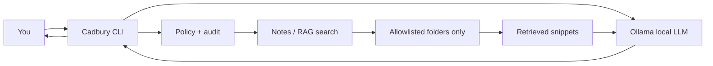

# Cadbury

> **Your local-first personal assistant.** Searches only what you allow. Stays on your Mac.


---

## What It Does

Cadbury is a local-first personal assistant that runs on your Mac. You chat with it in the terminal. It searches only the folders you allow, cites its sources, and logs everything it does. Your notes and prompts stay on your machine by default.

```bash
start cadbury
```

---

## Why Cadbury?

| | Cadbury | Cloud assistants (ChatGPT, Claude, Gemini) |
|--|---------|---------------------------------------------|
| **Where data goes** | Stays local (Ollama + your disk) | Vendor cloud |
| **Who controls access** | You (allowlisted paths, approvals) | Vendor product policy |
| **Offline** | Yes, after models are downloaded | Limited |
| **Cost** | Free inference after setup | Subscriptions / API |
| **Raw IQ** | Smaller local model (~7B) | Frontier models |

Cadbury is for people who want **control and privacy** first, and are fine trading some answer quality for that.

---

## Why Build This?

Frontier cloud assistants are excellent at general reasoning, writing, and coding. This project is not trying to beat them on a leaderboard. It exists because they solve a different problem than the one I cared about.

**1. Learning how assistants actually work**
Using ChatGPT is like driving a car. Building Cadbury is like opening the hood: local inference (Ollama), retrieval, tool permissions, audit logs, and config-driven boundaries. That exposure is the main goal, not shipping a commercial competitor.

**2. Privacy for real personal data**
Course folders, transcripts, work notes, and drafts are sensitive. With Cadbury, prompts and retrieved file text stay on my Mac by default. Cloud tools can be careful with policy, but I cannot see or change their enforcement code. Here I can.

**3. Permissions I can enforce in code**
I wanted rules that are explicit and boring: only certain folders, approval before search, an audit trail, no silent web or calendar access. Cadbury's policy layer is small on purpose. It is the product.

**4. A tool I own and can share safely**
Colleagues can clone the repo, run their own Ollama model, and use their own allowlisted paths. No shared cloud account, no commingled data.

**5. Honest tradeoff**
Cadbury uses a ~7B local model, so it will not match Claude or GPT-4 on hard tasks. That is acceptable. The value is control, citations from local files, and learning, not replacing every cloud agent.

When I still use cloud AI: open-ended research, heavy coding reviews, or tasks where maximum model quality matters. Cadbury and cloud tools coexist fine.

---

## The Story Behind This

I built Cadbury because I kept feeling uneasy about pasting personal notes, course transcripts, and work drafts into cloud chat interfaces. I did not want to stop using AI assistance for my own files. I just wanted to know exactly where my data was going.

So I built something where the answer is simple: it stays on my Mac.

Every part of this system is something I actually use. The allowlisted paths, the audit log, the approval prompts before reading notes. It is not a polished product. It is a tool I trust because I can read every line of it.

---

## Features (v0.2)

- **Local chat** via [Ollama](https://ollama.com) (default: Qwen 2.5 7B)
- **Allowlisted file search** - `.md`, `.txt`, `.pdf`, `.docx`, and more
- **Semantic search** - `cadbury index` builds an embedding index for better meaning matches
- **Source citations** - answers include `Sources:` with file paths
- **Interactive session** - `start cadbury`, with `/help`, `/strict`, `/approve`, and more
- **Security by default** - tools denied unless configured; optional approval before reading notes
- **Audit log** - `~/.cadbury/audit.log`

**Planned / optional:** voice, calendar, web search, desktop app packaging.

---

## Requirements

- **macOS** (Apple Silicon recommended, M-series)
- **Python 3.11+**
- **Ollama** installed and running
- **10 to 30 GB** free disk (LLM + optional index + embeddings)
- **16 GB RAM** recommended for comfortable 7B model use

---

## Quick Start

### 1. Install Ollama and pull a model

Download from [ollama.com](https://ollama.com/download), then:

```bash
ollama pull qwen2.5:7b-instruct
```

### 2. Install Cadbury

```bash
git clone <your-repo-url> cadbury
cd cadbury
chmod +x install.sh
./install.sh
```

Or manually:

```bash
python3 -m venv .venv
source .venv/bin/activate
pip install -e .
cp config.example.yaml config.yaml
```

Edit `config.yaml` and set your allowed folders:

```yaml
allowed_paths:
  - "/path/to/your/folder"
```

### 3. Build the semantic index (recommended)

```bash
source .venv/bin/activate
cadbury index
```

### 4. Start chatting

```bash
start cadbury
```

On first use you may be asked to approve note access (`/approve` or answer `y` when prompted).

---

## Commands

| Command | Description |
|---------|-------------|
| `start cadbury` | Main entry - interactive chat |
| `cadbury start` | Same as above |
| `cadbury doctor` | Health check (Ollama, config, index, deps) |
| `cadbury config` | Show loaded configuration |
| `cadbury index` | Build/update semantic search index |
| `cadbury ask "..."` | One-shot question with file retrieval |
| `cadbury search "..."` | Search allowlisted paths only |
| `cadbury chat "..."` | Plain chat (no file retrieval) |

---

## Interactive Commands

Inside `start cadbury`:

| Command | Effect |
|---------|--------|
| `/help` | Show commands |
| `/bye` or `/exit` | Quit |
| `/notes on` / `/notes off` | Toggle file retrieval |
| `/strict on` / `/strict off` | Require local sources before answering |
| `/approve` | Approve note search for this session |
| `/index` | Rebuild semantic index |
| `/config` | Show config |
| `/doctor` | Run health checks |

---

## Configuration

Cadbury loads config from (first match wins):

1. `~/.cadbury/config.yaml` - recommended for personal machines
2. `./config.yaml` - project-local fallback

Copy from `config.example.yaml`. Do not commit your real `config.yaml` (it may contain personal paths).

Key options:

| Key | Purpose |
|-----|---------|
| `allowed_paths` | Folders Cadbury may read (required for search) |
| `model_name` | Ollama model id |
| `require_tool_approval` | Prompt before searching notes |
| `use_embeddings` | Use semantic index when present |
| `voice_enabled` | Off by default; optional voice stack |

---

## How It Works



The LLM never opens files directly. Cadbury searches allowlisted paths, passes text as context, and the model answers from that context.

---

## Security

- **Deny by default** for tools (calendar, web, etc. are stubs unless enabled)
- **Allowlist only** - no whole-disk search
- **Audit trail** - `~/.cadbury/audit.log`
- **No telemetry** built in

Details: [SECURITY.md](SECURITY.md).

---

## Project Layout

```text
cadbury/
├── README.md
├── SECURITY.md
├── config.example.yaml   # template (safe to commit)
├── install.sh
├── pyproject.toml
├── requirements.txt
├── bin/start             # `start cadbury` launcher
└── src/
    ├── cli.py            # command-line entry
    ├── chat.py           # chat, ask, interactive loop
    ├── config.py         # YAML configuration
    ├── notes.py          # file reading + keyword search
    ├── rag.py            # embedding index + semantic search
    ├── policy.py         # permissions + audit log
    ├── tools.py          # future tools (calendar, web stubs)
    └── voice.py          # optional voice (off by default)
```

---

## Sharing With Others

1. Push the repo without `config.yaml` or personal data.
2. Each person runs `./install.sh` and creates their own `~/.cadbury/config.yaml`.
3. Each person runs `ollama pull` and `cadbury index` on their own machine.
4. Their files never leave their Mac unless they enable future web tools.

---

## Before You Push to Git

Run from the project folder:

```bash
git status
git check-ignore -v config.yaml DEVLOG.private.md .venv 2>/dev/null
```

Files that must never be committed:

| Item | Why | Protected by |
|------|-----|----------------|
| `config.yaml` | Your real folder paths | `.gitignore` |
| `DEVLOG.private.md` | Personal dev notes, errors, paths | `.gitignore` |
| `.venv/` | Local environment | `.gitignore` |
| `.env` / API keys | Secrets if added later | `.gitignore` |
| `~/.cadbury/audit.log` | May contain prompts and paths | Lives outside repo |
| `~/.cadbury/rag/` | Index of your file text | Lives outside repo |

Safe to commit: `README.md`, `SECURITY.md`, `config.example.yaml` (generic paths only), `src/`, `install.sh`, `pyproject.toml`.

Quick scan for leaks before pushing:

```bash
grep -rE "atharva|UCSD|/Users/|API_KEY|password|secret" --include="*.py" --include="*.yaml" --include="*.md" . \
  --exclude-dir=.venv --exclude="*.private.md" --exclude="config.yaml" || echo "No obvious leaks in tracked files"
```

Use `config.example.yaml` with placeholder paths only, never your real directories.

---

## Roadmap

- [x] v0.1 - Local chat, allowlisted search, policy, audit, interactive CLI
- [x] v0.2 - Semantic index (`cadbury index`), `start cadbury`
- [ ] Calendar read-only (optional)
- [ ] Web search toggle (optional, off by default)
- [ ] Voice (optional; disabled by default)
- [ ] macOS app / easier install for non-developers

---

## License

MIT License. See [LICENSE](LICENSE) for details.

---

## Author

**Atharva Hirulkar** - MS Data Science, UC San Diego  
[GitHub](https://github.com/atharvahirulkar) · [LinkedIn](https://linkedin.com/in/atharva-hirulkar)
